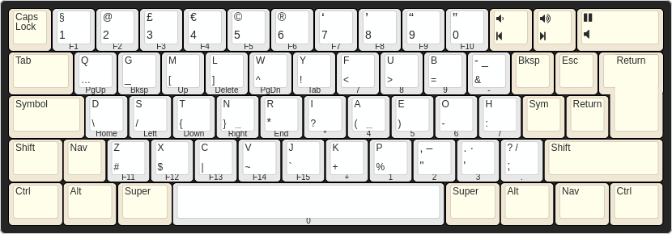

# The Jeo Keyboard Layout

Jeo is a keyboard layout which is optimised for software development.
[Learn more](https://jeolayout.org/)

## macOS install

At the moment, the best way to use Jeo on macOS is via [Hammerspoon][].  This
is pretty straightforward to set up – go check out [hammerspoon/README.md][].

The only caveat is that Hammerspoon has no effect during ‘secure text entry’,
which means that you’ll have to make do with QWERTY when typing in passwords.
Note that Terminal.app has a setting where you can force _everything_ you type
to be sent via secure entry; I suggest you turn that off if you want to use Jeo
at the shell…

[Hammerspoon]: https://www.hammerspoon.org/
[hammerspoon/README.md]: https://github.com/joecridge/jeo/tree/master/hammerspoon

## Linux install

Linux/X11 install is a little more fiddly (but not awful!).  The plus side is
that it works everywhere.  See [xkb/README.md][].

[xkb/README.md]: https://github.com/joecridge/jeo/tree/master/xkb
